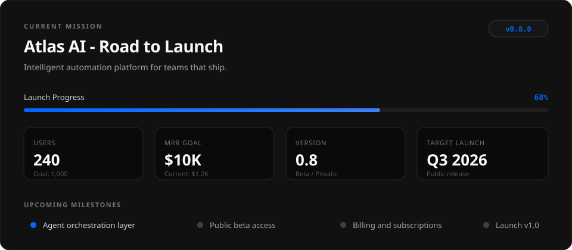
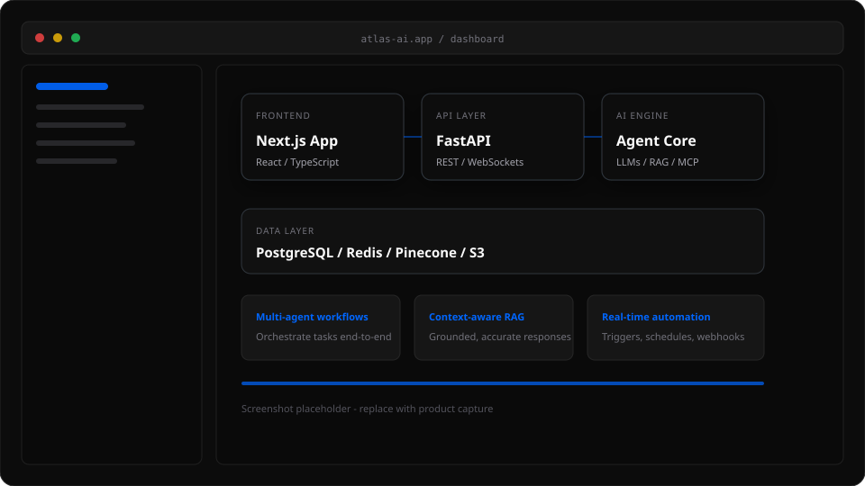
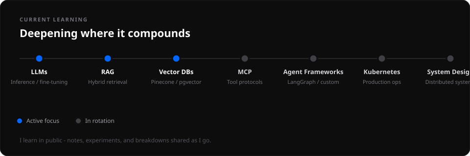
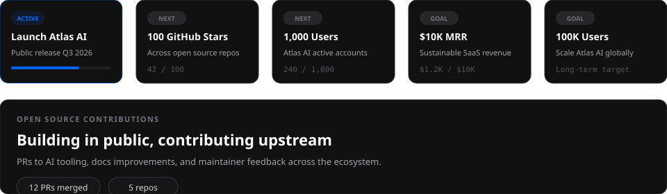

<!-- ═══════════════════════════════════════════════════════════════════════════
     GITHUB PROFILE README — Gaurav Nidhi
     Design: Premium · Minimal · Black / White / Blue
     Edit tips: Update GITHUB_USERNAME, links, and metrics in each section below.
     ═══════════════════════════════════════════════════════════════════════════ -->

<!-- ─── SECTION 1 · HERO ─────────────────────────────────────────────────── -->

<picture>
  <source media="(prefers-color-scheme: dark)" srcset="./assets/banner.svg">
  <source media="(prefers-color-scheme: light)" srcset="./assets/banner.svg">
  
</picture>

<br><br>

<h1 align="left">
  <a href="https://git.io/typing-svg">
    
  </a>
</h1>

<p align="left">
  <strong>Designing intelligent systems that feel inevitable — not experimental.</strong><br>
  I build production-grade AI products, from agent orchestration to polished interfaces.<br>
  Currently focused on <strong>Atlas AI</strong> — automation infrastructure for teams that ship.
</p>

<br>

<!-- ─── SECTION 2 · ABOUT ────────────────────────────────────────────────── -->


<br>

### About

I'm an **AI Engineer** and **Full Stack Developer** who cares as much about system design as about the details users never see.

My work sits at the intersection of **LLMs**, **agentic AI**, and **SaaS** — designing systems that are reliable under load, honest about their limits, and built to evolve. I spend my days on **automation pipelines**, **RAG architectures**, and **product surfaces** that make complex AI feel simple.

I'm not interested in demos that don't survive contact with production. I care about **system design**, **clear abstractions**, and products that solve problems people actually have.

Outside of Atlas AI, I **learn in public** — sharing what works, what breaks, and what I'd do differently. I contribute to **open source** when I can make upstream better, not when I need another line on a README.

<br>

<!-- ─── SECTION 3 · CURRENT MISSION ────────────────────────────────────────── -->


<br>

### Current Mission



<!-- Edit roadmap metrics in assets/roadmap.svg -->

<br>

<!-- ─── SECTION 4 · FEATURED PROJECT ─────────────────────────────────────── -->


<br>

### Featured Project · Atlas AI

<table>
<tr>
<td width="62%" valign="top">

**Atlas AI** is an intelligent automation platform — multi-agent workflows, context-aware retrieval, and real-time orchestration for modern teams.

**Architecture**
```
Next.js  →  FastAPI  →  Agent Core  →  PostgreSQL / Redis / Vector Store
                ↓
         LLM providers · MCP tools · Webhooks
```

**Features**
- Multi-agent task orchestration with human-in-the-loop checkpoints
- Hybrid RAG with semantic + keyword retrieval
- Real-time triggers, schedules, and webhook automation
- Role-based access, audit logs, and usage analytics

**Tech Stack**

| Layer | Stack |
|:--|:--|
| Frontend | Next.js · React · TypeScript · Tailwind CSS |
| Backend | Python · FastAPI · WebSockets |
| AI | OpenAI · Anthropic · LangGraph · MCP |
| Data | PostgreSQL · Redis · Pinecone · S3 |
| Infra | Docker · Kubernetes · AWS · GitHub Actions |

</td>
<td width="38%" valign="top">



<br>

<p align="center">
  <a href="https://github.com/GauravNidhiCodes/atlas-ai">
    
  </a>
</p>
<p align="center">
  <a href="https://atlas-ai.app">
    
  </a>
</p>
<p align="center">
  <a href="https://docs.atlas-ai.app">
    
  </a>
</p>

</td>
</tr>
</table>

<br>

<!-- ─── SECTION 5 · TECH STACK ─────────────────────────────────────────────── -->


<br>

### Tech Stack

<p align="left"><strong>Frontend</strong></p>
<p align="left">
  
</p>

<p align="left"><strong>Backend</strong></p>
<p align="left">
  
</p>

<p align="left"><strong>AI</strong></p>
<p align="left">
  
</p>

<p align="left"><strong>Databases</strong></p>
<p align="left">
  
</p>

<p align="left"><strong>Cloud</strong></p>
<p align="left">
  
</p>

<p align="left"><strong>DevOps</strong></p>
<p align="left">
  
</p>

<p align="left"><strong>Tools</strong></p>
<p align="left">
  
</p>

<p align="left"><strong>Languages</strong></p>
<p align="left">
  
</p>

<br>

<!-- ─── SECTION 6 · GITHUB ANALYTICS ───────────────────────────────────────── -->


<br>

### GitHub Analytics

<!-- Replace GauravNidhiCodes with your GitHub username if different -->

<p align="center">
  
</p>

<p align="center">
  
  &nbsp;
  
</p>

<p align="center">
  
  &nbsp;
  
</p>

<p align="center">
  
  &nbsp;
  
</p>

<br>

<!-- ─── SECTION 7 · DEVELOPMENT PHILOSOPHY ─────────────────────────────────── -->


<br>

### Development Philosophy


<br>

<!-- ─── SECTION 8 · CURRENT LEARNING ───────────────────────────────────────── -->


<br>

### Current Learning



<br>

<!-- ─── SECTION 9 · OPEN SOURCE ──────────────────────────────────────────── -->


<br>

### Open Source

<table>
<tr>
<td width="33%" valign="top">

**Projects**

Maintaining and building tools around AI infrastructure, developer experience, and automation primitives.

- [Atlas AI SDK](https://github.com/GauravNidhiCodes) — Agent workflow utilities
- [rag-kit](https://github.com/GauravNidhiCodes) — Lightweight RAG starter
- More shipping on the roadmap

</td>
<td width="33%" valign="top">

**Contributions**

Upstream PRs across AI tooling, documentation, and developer libraries. I prefer focused changes with clear intent over drive-by commits.

- Docs & DX improvements
- Bug fixes with reproduction steps
- Feature proposals with trade-off analysis

</td>
<td width="33%" valign="top">

**Future Goals**

- Open-source core Atlas AI modules
- Publish agent design patterns
- Mentor contributors on first OSS PRs
- Build reusable MCP server templates

</td>
</tr>
</table>

<br>

<!-- ─── SECTION 10 · ACHIEVEMENTS ──────────────────────────────────────────── -->


<br>

### Achievements

Real milestones — tracked honestly, updated as they land.



<br>

<!-- ─── SECTION 11 · CONNECT ───────────────────────────────────────────────── -->


<br>

### Connect

<p align="left">
  <a href="https://gauravnidhi.dev">
    
  </a>
  &nbsp;
  <a href="https://gauravnidhi.dev/portfolio">
    
  </a>
  &nbsp;
  <a href="https://linkedin.com/in/gauravnidhi">
    
  </a>
  &nbsp;
  <a href="https://twitter.com/gauravnidhi">
    
  </a>
  &nbsp;
  <a href="mailto:hello@gauravnidhi.dev">
    
  </a>
</p>

<br>

<!-- ─── SECTION 12 · FOOTER ────────────────────────────────────────────────── -->


<br>

<p align="center">
  <em>"The best systems disappear into the workflow — and leave room for the human decision that matters."</em>
</p>

<p align="center">
  <sub>Gaurav Nidhi · AI Engineer · Atlas AI · 2026</sub>
</p>

<p align="center">
  
</p>

<!-- ═══════════════════════════════════════════════════════════════════════════
     End of profile README
     ═══════════════════════════════════════════════════════════════════════════ -->
