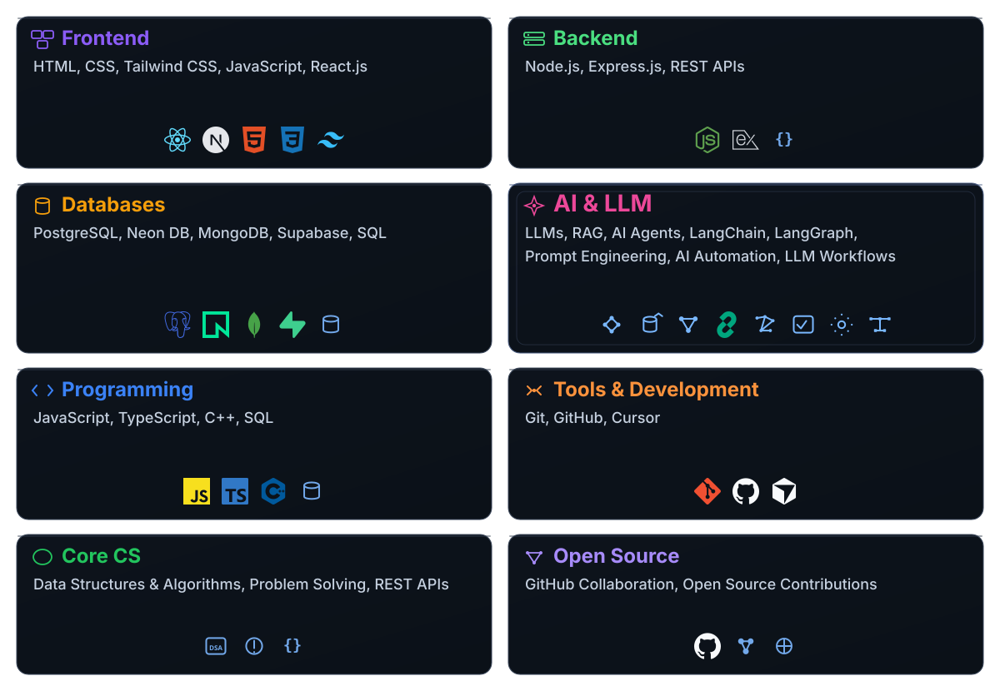

<!-- Profile README — edit links and copy below -->

# Gaurav Nidhi

B.Tech (CSE) | AI Developer | React.js | Node.js | FastAPI | AI Automation | RAG | LLM Workflows | Exploring GenAI

 

  

 

---

 

### What I'm into

I'm at the beginning of my Computer Science journey, learning by building and figuring things out as I go. I'm exploring LLMs, AI agents, RAG, backend, frontend, APIs, databases and modern web development by actually building things, breaking them and figuring out how to make them better. I'm still early, but I know what I want to learn and I'm enjoying the process of getting better at it. This GitHub is just a place to document that journey and the things I build along the way.

 

 

### Tech Stack

  <picture>
    <source media="(max-width: 860px)" srcset="./assets/tech-stack-cards-mobile.svg" />
    
  </picture>

 

---

 

### Open source

I maintain a few small tools around AI infra and developer experience. Nothing flashy — mostly utilities I needed while building Atlas AI and decided to open up.

If you're working on agents, RAG, or automation — happy to collaborate or review a PR.

 

---

 

### Connect

  
  &nbsp;&nbsp;&nbsp;
  
  &nbsp;&nbsp;&nbsp;
  

 

---

 

Build. Ship. Improve. Repeat.

